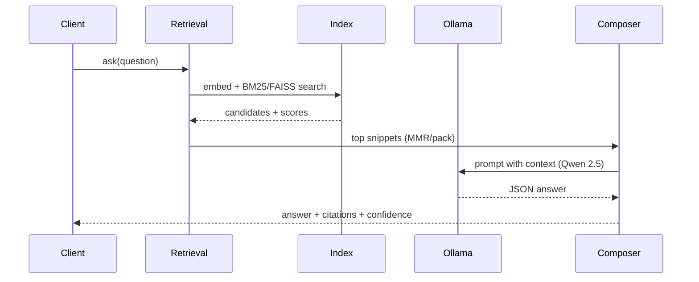

# Clockify RAG – Internal Support Assistant

RAG service that answers Clockify/CAKE support questions from the internal help corpus. Uses **Qwen 2.5 (32B) via internal Ollama** plus hybrid BM25 + FAISS retrieval and answer validation with citations.

## What it does
- Clockify/CAKE help-center assistant with citations and refusal on missing context.
- Hybrid retrieval (BM25 + FAISS + MMR) with intent-aware blending and token-budgeted context packing.
- Remote-first Ollama (Qwen + nomic-embed-text); local dev works on M1 Pro without external APIs.
- FastAPI API + Typer CLI (`clockify_rag.cli_modern`) for ingest/query/chat/demo.
- Deterministic ingestion and build locks to keep artifacts consistent across environments.

## Quickstart — local dev (macOS M1/M2/M3 Pro)

**Zero to working RAG in 10 steps** (no environment variables required):

```bash
# 1. Clone repository
git clone git@github.com:apet97/1rag.git
cd 1rag

# 2. Create and activate Python virtual environment
python3 -m venv .venv
source .venv/bin/activate

# 3. Upgrade pip
pip install --upgrade pip

# 4. Install dependencies
pip install -e .  # or: poetry install

# 5. (Optional) Verify environment
python -m clockify_rag.sanity_check

# 6. Build the KB index from bundled corpus
python -m clockify_rag.cli_modern ingest --input knowledge_full.md

# 7. Verify index artifacts
python -m clockify_rag.cli_modern doctor

# 8. Run tests
pytest

# 9. Start API server
uvicorn clockify_rag.api:app --reload

# 10. Try a query via CLI
python -m clockify_rag.cli_modern query "How do I lock timesheets?"
```

**Notes:**
- **Python 3.11–3.13** supported; 3.14+ blocked by guards in `clockify_rag.config`.
- **No VPN required** for local dev: default embedding backend is `local` (SentenceTransformer).
- **Default Ollama URL**: `http://10.127.0.192:11434` (internal VPN host). Override with `RAG_OLLAMA_URL` if needed.
- **For VPN/remote embeddings**: Set `EMB_BACKEND=ollama` for faster embedding via internal Ollama.
- **Comprehensive setup guide**: See [docs/INSTALL_macOS_ARM64.md](docs/INSTALL_macOS_ARM64.md) for troubleshooting, benchmarks, and M1-specific optimizations.

## Quickstart — internal deployment (VPN + internal Ollama/Qwen)
```bash
export RAG_OLLAMA_URL=http://<internal-ollama-host>:11434   # on VPN
export RAG_CHAT_MODEL=qwen2.5:32b
export RAG_EMBED_MODEL=nomic-embed-text:latest
export EMB_BACKEND=ollama                                  # remote embeddings

# Build or refresh the index from the help corpus
python -m clockify_rag.cli_modern ingest --input knowledge_full.md --force

# Run API
uvicorn clockify_rag.api:app --host 0.0.0.0 --port 8000
# or chat via CLI
python -m clockify_rag.cli_modern chat
```
Artifacts: `chunks.jsonl`, `vecs_n.npy`, `bm25.json`, `faiss.index` (when FAISS is available), and `index.meta.json` sit beside the repo.

## Architecture (Mermaid)
```mermaid
flowchart LR
  C[Client CLI/API] --> V[Validate & sanitize]
  V --> E[Embed query\nnomic-embed-text]
  E --> R[Hybrid retrieval\nBM25 + FAISS + MMR]
  R --> P[Pack snippets\n12000-token budget]
  P --> L[Ollama (Qwen 2.5:32B)]
  L --> A[Answer composer\ncitations + confidence]
  R --> I[Index artifacts\nchunks/bm25/faiss/meta]
  A --> C2[Response + citations]
```

### RAG pipeline (sequence)


## Pipeline summary
- **Ingestion**: `knowledge_full.md` → `clockify_rag.chunking.build_chunks` → `clockify_rag.embedding` (local or Ollama) → `clockify_rag.indexing.build` writes BM25 + FAISS + metadata.
- **Online query**: question → sanitize/length guard → embed → hybrid BM25+dense → MMR diversification → pack to 12K-token budget → `clockify_rag.llm_client` (ChatOllama/Qwen) → citations + confidence routing in `clockify_rag.answer`.

## Key components
- `clockify_rag/config.py` – configuration defaults, env parsing, model selection.
- `clockify_rag/retrieval.py` – hybrid retrieval, MMR, packing, rerank hooks.
- `clockify_rag/answer.py` – orchestration, refusal, citation validation.
- `clockify_rag/embedding.py` & `clockify_rag/embeddings_client.py` – local vs Ollama embeddings.
- `clockify_rag/indexing.py` – chunking, embedding, BM25/FAISS build + lock handling.
- `clockify_rag/cli_modern.py` – Typer CLI (`ingest`, `query`, `chat`, `doctor`).
- `clockify_rag/api.py` – FastAPI service surface.
- `clockify_rag/sanity_check.py` – connectivity and end-to-end probe.
- Helpers: `scripts/generate_chunk_title_map.py` (chunk lookup), `scripts/build_faq_cache.py` (optional cache).

## Configuration (high level)
- **Ollama host/model**: `RAG_OLLAMA_URL`, `RAG_CHAT_MODEL`, `RAG_EMBED_MODEL`.
- **Embedding backend**: `EMB_BACKEND=ollama` (production) or `local` (offline dev, default).
- **Retrieval**: `DEFAULT_TOP_K` (15), `DEFAULT_PACK_TOP` (8), `DEFAULT_THRESHOLD` (0.25), `ALPHA` (0.5), `MMR_LAMBDA` (0.75).
- **Budgets**: `CTX_BUDGET=12000`, `DEFAULT_NUM_CTX=32768`, `DEFAULT_NUM_PREDICT=512`.
- **Timeouts**: `CHAT_CONNECT_TIMEOUT`, `CHAT_READ_TIMEOUT`, `EMB_CONNECT_TIMEOUT`, `EMB_READ_TIMEOUT`, `DEFAULT_RETRIES`.
- See `docs/CONFIGURATION.md` for the full matrix and sample `.env` snippets for VPN vs local.

## Testing & CI
- Fast checks: `python -m clockify_rag.sanity_check`
- Unit/integration: `pytest -q`
- Smoke (mock LLM by default): `make smoke` or `python scripts/smoke_rag.py`
- CI runs lint/format/tests; keep docs updated when behavior changes.

## 5-minute demo script
1) Ensure `knowledge_full.md` is present (latest export from the internal help corpus).
2) Build artifacts: `python -m clockify_rag.cli_modern ingest --input knowledge_full.md --force`.
3) Start chat: `python -m clockify_rag.cli_modern chat` (or run `uvicorn clockify_rag.api:app` and POST to `/v1/query`).
4) Ask a few live questions:
   - “Add time for others”
   - “Lock timesheets”
   - “Manage overtime limits”
5) Show observability:
   - Tail `rag_queries.jsonl` if logging enabled.
   - `GET /v1/metrics` when API is running.
   - Point out citations in responses.

## Troubleshooting (common)
- **Ollama unreachable**: verify VPN and `curl $RAG_OLLAMA_URL/api/tags`; fall back to local with `RAG_OLLAMA_URL=http://127.0.0.1:11434` and `EMB_BACKEND=local`.
- **FAISS missing on M1**: `conda install -c conda-forge faiss-cpu=1.8.0`; system falls back to linear search if absent.
- **Python 3.14**: blocked at import time; use 3.11–3.13.
- **Index drift**: delete artifacts and rebuild: `rm -f chunks.jsonl vecs_n.npy bm25.json faiss.index index.meta.json && python -m clockify_rag.cli_modern ingest --input knowledge_full.md`.

## Docs to read next
- `docs/ARCHITECTURE.md` – deeper dive + diagrams.
- `docs/CONFIGURATION.md` – env knobs for VPN vs local.
- `docs/HELP_CORPUS.md` – how the help corpus is refreshed and indexed.
- `docs/OPERATIONS.md` – runbook for smoke tests and deployments.
