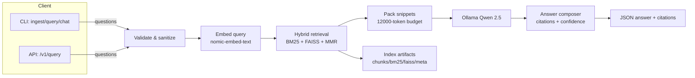
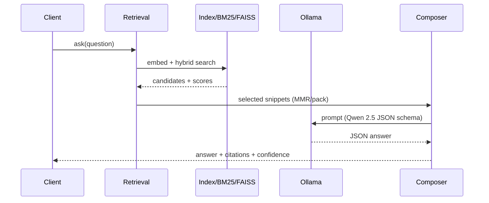

# System Architecture

Clockify RAG is a remote-first, Ollama-backed RAG stack for the Clockify/CAKE help corpus. This document explains how the pieces fit together for both local M1 development and internal VPN deployment.

## High-level overview
- **Entry points**: Typer CLI (`clockify_rag.cli_modern`: ingest/query/chat/doctor) and FastAPI (`clockify_rag.api:app`).
- **Models**: Qwen 2.5 (32B) for generation; `nomic-embed-text` for embeddings via Ollama. No external providers are used in the active pipeline.
- **Retrieval**: BM25 + FAISS (when available) blended with intent-aware alpha and MMR diversification; 12K-token packing budget.
- **Artifacts**: `chunks.jsonl`, `vecs_n.npy`, `bm25.json`, `faiss.index` (optional), and `index.meta.json` are rebuilt deterministically beside the repo.
- **Observability**: optional JSONL query log, timing metrics in `clockify_rag.metrics`, `/v1/metrics` when the API is running.

## Architecture diagram

## Pipelines

### Ingestion (offline)
1. **Source**: `knowledge_full.md` (latest help-center export; see `docs/HELP_CORPUS.md`).
2. **Chunking**: `clockify_rag.chunking.build_chunks` performs heading-aware splits with overlap (`CHUNK_CHARS`, `CHUNK_OVERLAP`).
3. **Embeddings**: `clockify_rag.embedding.embed_texts` chooses local vs Ollama via `EMB_BACKEND`.
4. **Indexing**: `clockify_rag.indexing.build` writes BM25 stats, FAISS index (when available), and `index.meta.json`; guarded by `.build.lock`.
5. **Validation**: `clockify_rag.cli_modern ingest` revalidates artifacts and reports sizes/paths.

### Query (online)
1. **Sanitize**: `clockify_rag.retrieval.validate_query_length` enforces length caps (`MAX_QUERY_LENGTH`).
2. **Embed query**: `clockify_rag.embedding.embed_query` (local or Ollama).
3. **Hybrid retrieval**: BM25 + dense search blended with `ALPHA`, intent-aware adjustments, and candidate limits (`DEFAULT_TOP_K`, `MAX_TOP_K`).
4. **MMR + packing**: `clockify_rag.retrieval.pack_snippets` diversifies and trims to `CTX_BUDGET`/`DEFAULT_NUM_CTX`.
5. **Generation**: `clockify_rag.llm_client` (ChatOllama) invoked by `clockify_rag.answer.answer_once`; retries/timeouts come from `clockify_rag.config`.
6. **Validation & routing**: citation enforcement (`STRICT_CITATIONS`), confidence routing (`clockify_rag.confidence_routing`), optional FAQ cache.
7. **Return**: CLI/API respond with answer + citations + confidence; optional logging to `rag_queries.jsonl`.

## Sequence (query)

## Modules and responsibilities
- **Configuration**: `clockify_rag/config.py` (env parsing, defaults, model selection, timeouts).
- **Chunking & ingestion**: `clockify_rag/chunking.py`, `clockify_rag/ingestion.py`, `clockify_rag/indexing.py`.
- **Embeddings**: `clockify_rag/embedding.py` (local batching/cache) and `clockify_rag/embeddings_client.py` (Ollama).
- **Retrieval**: `clockify_rag/retrieval.py` (hybrid scoring, MMR, packing, optional rerank).
- **Answering**: `clockify_rag/answer.py` (LLM call, citations, refusal), `clockify_rag/llm_client.py`.
- **Interfaces**: `clockify_rag/cli_modern.py` (Typer), `clockify_rag/api.py` (FastAPI), `clockify_rag/sanity_check.py`.
- **Observability**: `clockify_rag/metrics.py`, logging helpers in `clockify_rag/logging_config.py`, optional `rag_queries.jsonl`.

## Artifacts and storage
- **Input**: `knowledge_full.md` (help corpus).
- **Generated**: `chunks.jsonl`, `vecs_n.npy`, `bm25.json`, `faiss.index` (when FAISS present), `index.meta.json`, optional `rag_queries.jsonl`.
- **Locks**: `.build.lock` prevents concurrent ingest.
- **FAQ cache (optional)**: `faq_cache.json` when generated via `scripts/build_faq_cache.py`.

## Deployment notes
- Use `EMB_BACKEND=ollama` and `RAG_OLLAMA_URL` pointing to the internal host on VPN for production. Local dev can stay on `EMB_BACKEND=local`.
- Timeouts/retries (`CHAT_CONNECT_TIMEOUT`, `CHAT_READ_TIMEOUT`, `DEFAULT_RETRIES`) are tuned for VPN latency; increase cautiously for slower links.
- FAISS is preferred; when missing (common on fresh M1 setups) the system falls back to linear search + BM25 until FAISS is installed.

## Related docs
- Quick start and demo flow: `README.md`
- Configuration matrix: `docs/CONFIGURATION.md`
- Corpus/ingestion: `docs/HELP_CORPUS.md`
- Operations/runbook: `docs/OPERATIONS.md`
